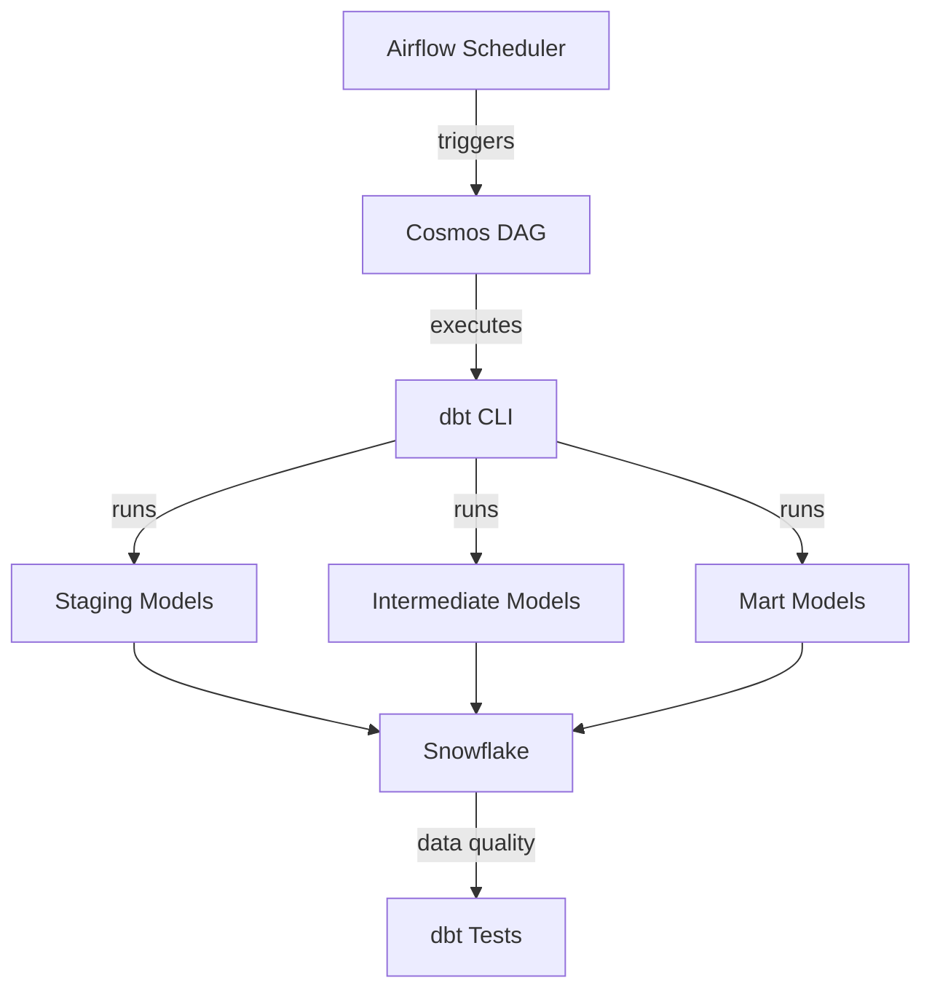

# Data-Pipeline Orchestration (Airflow + Astronomer Cosmos)

**Project type:** Workflow orchestration  
**Tools used:** Apache Airflow, Astronomer Cosmos, Astro CLI, dbt, Snowflake  
**Target environment:** Astronomer (Local Development)

## Project overview

This repository contains the Apache Airflow orchestration layer that manages the execution of dbt transformations for the TPCH data pipeline. Using Astronomer Cosmos, this project seamlessly integrates dbt models into Airflow DAGs.

**Key features:**
- Automated scheduling of dbt runs
- Visual representation of dbt model dependencies in Airflow UI
- Granular task-level control and monitoring
- Retry logic and error handling
- Containerized deployment using Astro CLI

## Orchestration flow



## Repository structure

```
dbt-dag/
├── README.md
├── Dockerfile                   # Custom Docker configuration
├── requirements.txt             # Python dependencies
├── packages.txt                 # OS-level packages
├── airflow_settings.yaml        # Airflow connections and variables
├── .env                         # Environment variables
├── dags/
│   ├── dbt_dag.py              # Main dbt orchestration DAG
│   └── dbt/
│       └── data_pipeline/      # dbt project files
│           ├── dbt_project.yml
│           ├── models/
│           ├── macros/
│           ├── tests/
│           └── ...
├── plugins/                     # Custom Airflow plugins
├── include/                     # Additional resources
└── tests/                       # DAG tests
```

## Prerequisites

- **Astro CLI** (Astronomer Command Line Interface)
- **Docker Desktop** (with Docker Compose)
- **Snowflake account** with appropriate permissions
- **dbt project** (data_pipeline)

## Setup instructions

### 1. Install Astro CLI

**macOS/Linux:**
```bash
brew install astro
```

**Windows:**
```bash
winget install -e --id Astronomer.Astro
```

Verify installation:
```bash
astro version
```

### 2. Clone the repository

```bash
git clone https://github.com/Nilan-1911/dbt-orchestration.git
cd dbt-orchestration
```

### 3. Configure Dockerfile

The `Dockerfile` includes a virtual environment for dbt:

```dockerfile
FROM quay.io/astronomer/astro-runtime:11.0.0

# Create virtual environment for dbt
RUN python -m venv dbt_venv && source dbt_venv/bin/activate && \
    pip install --no-cache-dir dbt-snowflake && deactivate
```

### 4. Configure requirements.txt

```txt
astronomer-cosmos
apache-airflow-providers-snowflake
```

### 5. Add dbt project files

Copy your dbt project into the DAGs folder:

```bash
# From your dbt project directory
cp -r /path/to/data_pipeline dags/dbt/data_pipeline
```

**Note:** The dbt project should be located at `dags/dbt/data_pipeline/`

### 6. Create the DAG file

Create `dags/dbt_dag.py`:

```python
import os
from datetime import datetime
from cosmos import DbtDag, ProjectConfig, ProfileConfig, ExecutionConfig
from cosmos.profiles import SnowflakeUserPasswordProfileMapping

# Configure Snowflake profile
profile_config = ProfileConfig(
    profile_name="default",
    target_name="dev",
    profile_mapping=SnowflakeUserPasswordProfileMapping(
        conn_id="snowflake_conn", 
        profile_args={"database": "dbt_db", "schema": "dbt_schema"},
    )
)

# Create dbt DAG
dbt_snowflake_dag = DbtDag(
    project_config=ProjectConfig(
        "/usr/local/airflow/dags/dbt/data_pipeline",
    ),
    operator_args={"install_deps": True},
    profile_config=profile_config,
    execution_config=ExecutionConfig(
        dbt_executable_path=f"{os.environ['AIRFLOW_HOME']}/dbt_venv/bin/dbt",
    ),
    schedule_interval="@daily",
    start_date=datetime(2023, 9, 10),
    catchup=False,
    dag_id="dbt_dag",
)
```

### 7. Start Airflow locally

```bash
astro dev start
```

This command will:
- Build the Docker image with dbt installed
- Start the Airflow webserver, scheduler, and triggerer
- Initialize the Airflow database

**Access the Airflow UI:**
- URL: `http://localhost:8080`
- Username: `admin`
- Password: `admin`

### 8. Configure Snowflake connection

In the Airflow UI:

1. Navigate to **Admin** → **Connections**
2. Click the **+** button to add a new connection
3. Fill in the details:

| Field | Value |
|-------|-------|
| Connection Id | `snowflake_conn` |
| Connection Type | `Snowflake` |
| Account | `<your_account>` |
| User | `<your_username>` |
| Password | `<your_password>` |
| Role | `<your_role>` |
| Warehouse | `<your_warehouse>` |
| Database | `dbt_db` |
| Schema | `dbt_schema` |

4. Click **Save**

### 9. Trigger the DAG

1. In the Airflow UI, locate the `dbt_dag`
2. Toggle the DAG to **ON** (unpause)
3. Click the **Play** button to trigger manually
4. View the task execution in the **Graph** or **Grid** view

## DAG configuration

### Schedule options

```python
# Daily at midnight
schedule_interval="@daily"

# Every 6 hours
schedule_interval="0 */6 * * *"

# Manual trigger only
schedule_interval=None
```

### Profile configuration

The DAG uses `SnowflakeUserPasswordProfileMapping` to connect to Snowflake:

```python
profile_config = ProfileConfig(
    profile_name="default",
    target_name="dev",
    profile_mapping=SnowflakeUserPasswordProfileMapping(
        conn_id="snowflake_conn",  # Airflow connection ID
        profile_args={
            "database": "dbt_db",
            "schema": "dbt_schema"
        },
    )
)
```

### Execution configuration

The `ExecutionConfig` specifies the path to the dbt executable:

```python
execution_config=ExecutionConfig(
    dbt_executable_path=f"{os.environ['AIRFLOW_HOME']}/dbt_venv/bin/dbt",
)
```

## Common Astro commands

| Command | Description |
|---------|-------------|
| `astro dev start` | Start Airflow locally |
| `astro dev stop` | Stop Airflow |
| `astro dev restart` | Restart Airflow |
| `astro dev logs` | View logs |
| `astro dev ps` | Check running containers |
| `astro dev bash` | Access scheduler container shell |
| `astro dev pytest` | Run DAG tests |

## Monitoring and debugging

### View DAG logs

**In Airflow UI:**
1. Click on the DAG run
2. Select a task
3. Click **Log** button

**In terminal:**
```bash
astro dev logs -f
```

### Test DAG syntax

```bash
# Validate DAG file
astro dev run dags test dbt_dag

# List all DAGs
astro dev run dags list
```

### Access scheduler shell

```bash
astro dev bash
cd /usr/local/airflow/dags/dbt/data_pipeline
dbt debug
```

## dbt project integration

This orchestration layer works with the dbt transformation project:

**Repository:** [https://github.com/Nilan-1911/data_pipeline](https://github.com/Nilan-1911/data_pipeline)

The dbt project is embedded in this repository at `dags/dbt/data_pipeline/` and contains:
- Staging models (stg_tpch_orders, stg_tpch_line_items)
- Intermediate models (int_order_items, int_order_items_summary)
- Mart models (fct_order)
- Custom tests and macros
